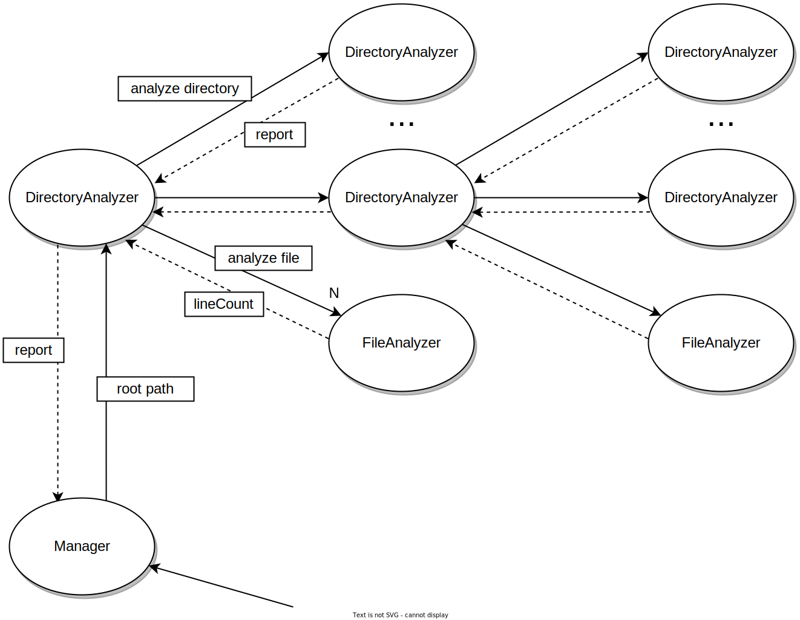
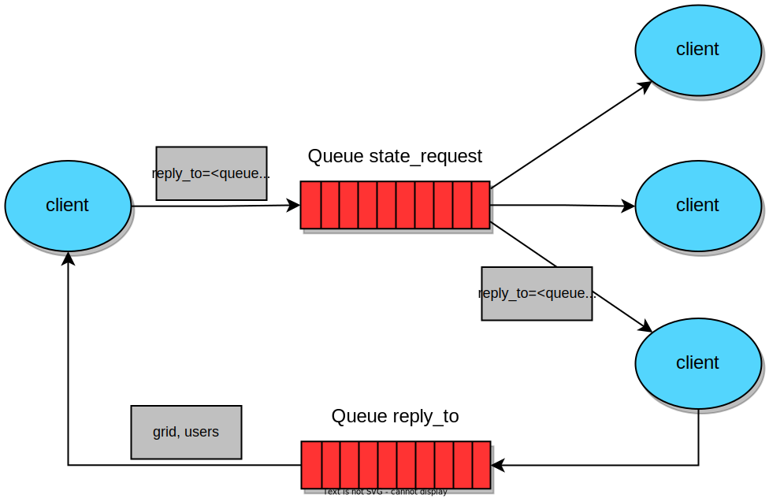
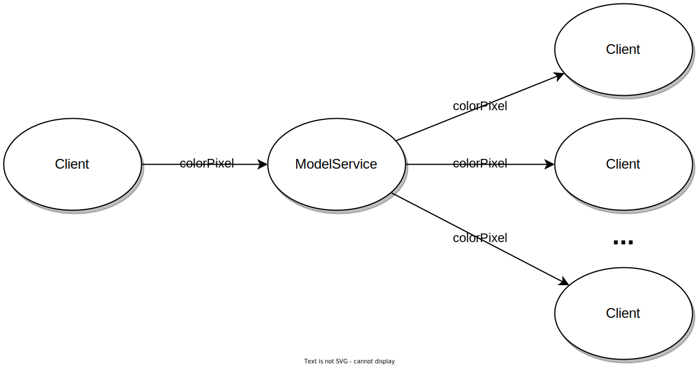
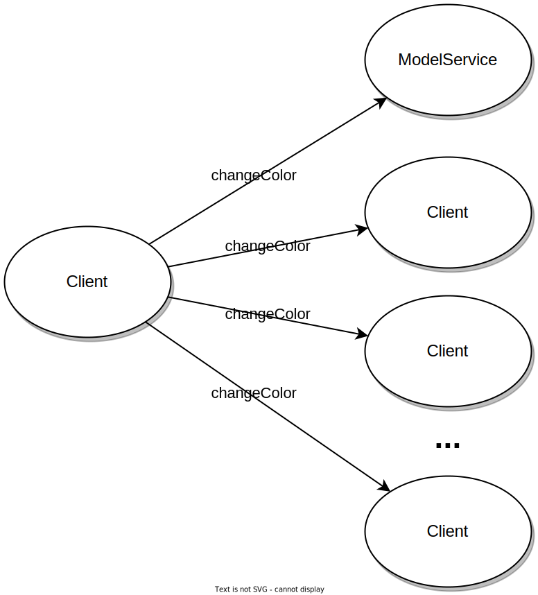
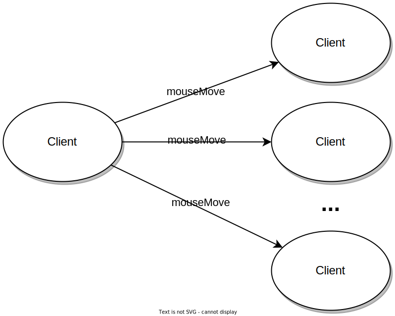
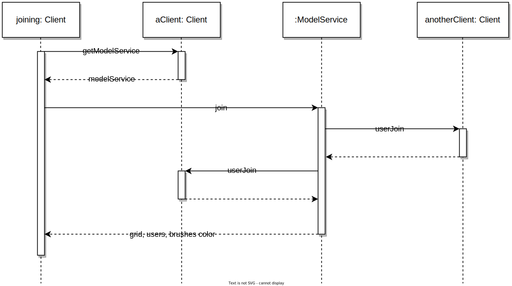

# PCD Assignment 03

Componenti:

- Manuel Andruccioli, manuel.andruccioli@studio.unibo.it
- Kelvin Olaiya, kelvinoluwada.olaiya@studio.unibo.it
- Giacomo Totaro, giacomo.totaro2@studio.unibo.it


## Part 1 - Actors

L'implementazione della soluzione è stata realizzata mediante il linguaggio *Scala*, in particolare utilizzando la libreria Akka, con attori tipizzati e behaviors.


### CLI

La soluzione proposta per la versione CLI è ispirata alla strategia *divide et impera*, esplorando la directory in modo ricorsivo. Vengono utilizzati i seguenti attori:

- **Manager:** questo attore è il punto d'ingresso del sistema, che crea il primo *DirectoryAnalyzer* con il root path di partenza. Inoltre, si occupa di stampare a video il risultato finale, al momento della ricezione del report finale.
- **DirectoryAnalyzer:** viene creata questa tipologia di attore *per ogni* sottocartella trovata ricorsivamente. Si occupa di aggregare i risultati dei figli, per poi inviarli al padre. Inoltre, crea un *FileAnalyzer*, che processa i file presenti nella cartella corrente.
- **FileAnalyzer:** ogni *DirectoryAnalyzer* crea un *FileAnalyzer*, al quale vengono inviati i path dei file da processare. Le linee conteggiate vengono inviate indietro al *DirectoryAnalyzer*, che si occupa dell'aggregazione.

<p align="center">
    
</p>


### GUI

La soluzione proposta per la versione GUI estende quella precedentemente descritta nell'approccio CLI. Dal momento che si vogliono osservare le statistiche in tempo reale e una leaderboard dei file più grandi, sono state aggiunte altre tipologie di attori. Inoltre, gli attori già descritti, cambiano la modalità di aggregazione dei risultati, non utilizzato più una strategia *divide et impera*.

Vengono utilizzati i seguenti attori:

- **Manager:** gestisce il boot del sistema, quindi inizializza gli altri attori e aspetta risposte da essi per poter partire o fermarsi.

<p align="center">
    
</p>

- **ViewActor:** si occupa di aggiornare il report e la leaderboard nella GUI ogni volta che gli arriva una richiesta di quel tipo. Inoltre il *Manager*, quando inizializza il sistema, gli richiede di settare la view giusta scelta dall'utente (CLI o GUI).
- **LeaderboardActor:** quest'attore ha il compito di mantenere aggiornata la leaderboard generale. Per questo attende di ricevere dai *DirectoryAnalyzer* gli aggiornamenti parziali per poi aggregarli. Dunque notifica il *ViewActor* dei vari aggiornamenti.

<p align="center">
    
</p>

- **SourceAnalyzer:** crea il primo *DirectoryAnalyzer* passandogli il root path di partenza insieme al riferimento dell'attore stesso. Dopodichè aspetta:
    - i report, fa il merge e chiede al *ViewActor* di aggiornare;
    - l'ack per notificare la terminazione del lavoro da parte del *DirectoryAnalyzer*;
    - l'halt nel momento in cui l'utente ferma il lavoro.
- **DirectoryAnalyzer:** questo attore viene creato per ogni sottocartella trovata ricorsivamente e, per ognuna di esse, crea un *FileAnalyzer* che si occupa di processare i file presenti nella cartella corrente. Ogni *DirectoryAnalyzer* aspetta i risultati dai suoi figli per poi inviarli aggregati al padre. Quando tutti hanno finito il proprio lavoro, il primo *DirectoryAnalyzer* creato invia l'ack, per notificare la terminazione del lavoro, il report finale al *SourceAnalyzer* e la leaderboard finale al *LeaderboardActor*.
- **FileAnalyzer:** ne viene creato uno per ogni *DirectoryAnalyzer* Questo riceve, per ogni file all'interno della directory corrente, un messaggio contente il path del file da analizzare. Quando ha finito restituisce al padre il risultato.

<p align="center">
    
</p>


### Schema d'interazione (versione con GUI): 

<p align="center">
    
</p>


## Part 2 - Distributed Programming with Asynchronous Message Passing

La soluzione proposta si basa sull'utilizzo di un Message Oriented Middleware, in particolare è stato utilizzato RabbitMQ. 

Vi sono diversi eventi che richiedono uno scambio di messagi tra peers. Per ciascuno di essi ogni *client*
possiede una coda *di ricezione*. Tali code sono collegate ad un exchange (specifico di un particolare tipo di evento).
Sono stati utilizzati exchange di tipo **fanout**, in modo che, ogni qualvolta un client invia un 
messaggio relativo ad un evento su quell'exchange, tutti gli altri utenti collegati ad esso possono riceverne una copia.
Inoltre, anche il client stesso riceve il proprio evento: questo garatisce uno *stato consistente* tra i vari client.

<p align="center">
    
</p>

Gli exchange, con i rispettivi tipi di messaggi, sono:

- `PIXEL_COLOR_EXCHANGE`: per notificare che un pixel del griglia è stato colorato.
    ```javascript
    PixelColor {
        user: UUID
        x: Int,
        y: Int,
    }
    ```
- `MOUSE_MOVE_EXCHANGE`: per notificare le posizioni dei puntatori dei vari utenti.
    ```javascript
    MouseMove {
        user: UUID
        x: Int,
        y: Int, 
    }
    ```
- `COLOR_CHANGE_EXCHANGE`: per notificare il cambio di colore dei puntatori degli utenti.
    ```javascript
    ColorChange {
        uuid: UUID,
        color: Int
    }
    ```
- `USER_EXIT_EXCHANGE`: per notificare l'abbandono della sessione di un utente.
    ```javascript
    UserExit {
        uuid: UUID
    }
    ```


### Join di un utente

L'implentazione di questa funzionalità si basa sul [pattern RPC](https://www.rabbitmq.com/tutorials/tutorial-six-java.html).
In particolare, un utente intenzionato a unirsi alla sessione, invia un messaggio di richiesta di *join* su una coda dedicata, sulla quale, tutti gli utenti che già partecipano alla sessione, sono in ascolto.
Dato che, in generale, la ricezione di un messaggio da parte di un client su una coda, fa sì che il messaggio venga consumato, la richiesta di join verrà presa in carico da un solo utente (in particolare RabbitMQ, adotta una politica Round-robin, [si veda qui](https://www.rabbitmq.com/tutorials/tutorial-two-java.html)).
Dunque, l'utente che riceve la richiesta di join, non farà altro che inviare lo stato della propria griglia insieme alla lista degli utenti che partecipano alla sessione.

```javascript
StateRequest { }

StateReply {
    grid: PixelGrid,
    users: Map<UUID, Int>
}
```
<p align="center">
    
</p>

Dato che la richiesta dello stato non comporta lo stop dei processi, è importante per il client che è intenzionato a partecipare alla sessione, collegarsi preventivamente con le proprie code agli exchange degli eventi (in particolare **pixel_color** e **color_change**) in modo tale che, quando riceve lo stato della griglia, possa *applicare* gli eventi ricevuti e bufferizzati, evitanto di trovarsi in uno stato inconsistente.

### Riguardo la concorrenza

In RabbitMQ, le callback di ricezione di un messaggio vengono eseguite da un **pool di thread**. Per questo motivo
si è reso necessario l'utilizzo di strutture dati concorrenti (ovvero una `TrieMap` e una `BlockingQueue`).
Inoltre, la classe `PixelGrid` è stata resa un *monitor*. Tutto ciò permette di evitare corse critiche.


## Part 3 - Distributed Programming with Distributed Objects

La soluzione proposta è stata implementata utilizzando Java Remote Method Invocation (`RMI`), mediante il linguaggio *Scala*.


### Architettura del sistema

L'architettura prevede l'interazione tra ogni *client* e il *ModelService*, ma anche un collegamento peer-to-peer tra i partecipanti.
Il *ModelService* è l'entità che si occupa di mantenere lo stato consistente della griglia, durante una sessione di disegno.

<p align="center">
    
</p>

- `Pixel coloring`: un client, per colorare un pixel della griglia, invia un messaggio al ModelService, il quale si occuperà di propagare l'evento a tutti gli altri partecipanti. Questo meccanismo garantisce uno stato consistente tra tutti i client che concorrono alla modifica della griglia.

<p align="center">
    
</p>

- `Brush change color & mouse move`: un client, per cambiare il colore del proprio pennello o per notificare il movimento del proprio mouse, non sfrutterà più il ModelService per fare broadcasting dei messaggi, bensì farà una chiamata remota tutti gli altri client.

<div style="text-align: center">
    <p align="center" style="display: inline-block; width: 49%; vertical-align: middle;">
        
    </p>
    <p align="center" style="display: inline-block; width: 49%; vertical-align: middle">
        
    </p>
</div>


### Join di un utente

Un client, per poter partecipare alla sessione, deve conoscere un rifertimento ad un altro utente già connesso al sistema.
In questo modo, può richiedere a quest'ultuimo l'istanza del *ModelService* della sessione, che consentirà di ottenere lo stato della griglia e la lista degli utenti connessi.
Inoltre, il *ModelService* notificherà a tutti gli altri client la presenza del nuovo utente.

<p align="center">
    
</p>
