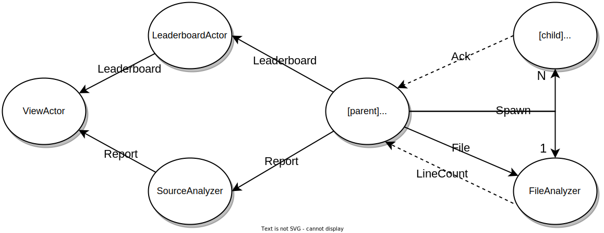
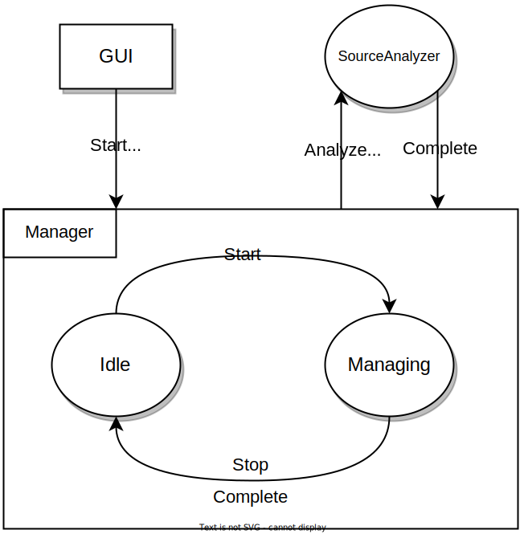
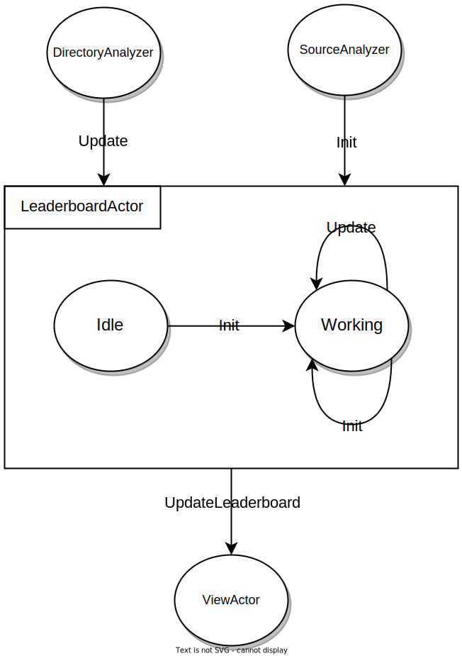
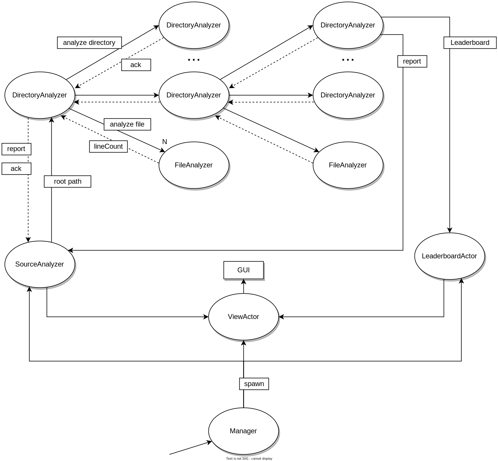

# PCD Assignment 03

Componenti:

- Manuel Andruccioli, manuel.andruccioli@studio.unibo.it
- Kelvin Olaiya, kelvinoluwada.olaiya@studio.unibo.it
- Giacomo Totaro, giacomo.totaro2@studio.unibo.it

## Part 1 - Actors

L'implementazione della soluzione è stata realizzata mediante il linguaggio *Scala*, in particolare utilizzando la libreria Akka, con attori tipizzati e behaviors.

### CLI

La soluzione proposta per la versione CLI è ispirata alla strategia *divide et impera*, esplorando la directory in modo ricorsivo. Vengono utilizzati i seguenti attori:

- **Manager:** questo attore è il punto d'ingresso del sistema, che crea il primo *DirectoryAnalyzer* con il root path di partenza. Inoltre, si occupa di stampare a video il risultato finale, al momento della ricezione del report finale.
- **DirectoryAnalyzer:** viene creata questa tipologia di attore *per ogni* sottocartella trovata ricorsivamente. Si occupa di aggregare i risultati dei figli, per poi inviarli al padre. Inoltre, crea un *FileAnalyzer*, che processa i file presenti nella cartella corrente.
- **FileAnalyzer:** ogni *DirectoryAnalyzer* crea un *FileAnalyzer*, al quale vengono inviati i path dei file da processare, inviando, per ciascuno di essi, il risultato al padre.

### GUI

Nella soluzione proposta per la versione GUI, vengono utilizzati i seguenti attori:

- **Manager:** gestisce il boot del sistema, quindi inizializza gli altri attori e aspetta risposte da essi per poter partire o fermarsi.

- **ViewActor:** si occupa di aggiornare il report e la leaderboard nella GUI ogni volta che gli arriva una richiesta di quel tipo. Inoltre il *Manager*, quando inizializza il sistema, gli richiede di settare la view giusta scelta dall'utente (CLI o GUI).
- **SourceAnalyzer:** crea il primo *DirectoryAnalyzer* passandogli il root path di partenza insieme al riferimento dell'attore stesso. Dopodichè aspetta:
    - i report, fa il merge e chiede al *ViewActor* di aggiornare;
    - l'ack per notificare la terminazione del lavoro da parte del *DirectoryAnalyzer*;
    - l'halt nel momento in cui l'utente ferma il lavoro.
- **DirectoryAnalyzer:** questo attore viene creato per ogni sottocartella trovata ricorsivamente e, per ognuna di esse, crea un *FileAnalyzer* che si occupa di processare i file presenti nella cartella corrente. Ogni *DirectoryAnalyzer* aspetta i risultati dai suoi figli per poi inviarli aggregati al padre. Quando tutti hanno finito il proprio lavoro, il primo *DirectoryAnalyzer* creato invia l'ack, per notificare la terminazione del lavoro, il report finale al *SourceAnalyzer* e la leaderboard finale al *LeaderboardActor*.
- **FileAnalyzer:** ne viene creato uno per ogni *DirectoryAnalyzer* Questo riceve, per ogni file all'interno della directory corrente, un messaggio contente il path del file da analizzare. Quando ha finito restituisce al padre il risultato.

- **LeaderboardActor:** quest' attore ha il compito di mantenere aggiornata la leaderboard generale. Per questo attende di ricevere da i *DirectoryAnalyzer* aggiornamenti parziali per poi aggregarli. Dunque notifica il *ViewActor* dei vari aggiornamenti.

### Schema d'interazione (versione con GUI): 

## Part 2 - Distributed Programming with Asynchronous Message Passing